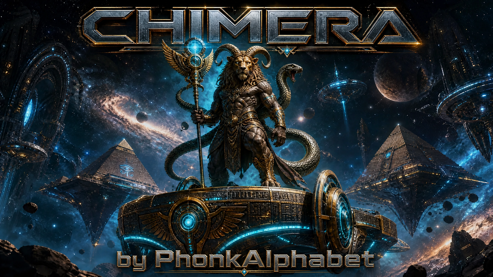

# CHIMERA — Autonomous Breach Engine v1.0
### ⚡️👾 by 🇭🇷 PhonkAlphabet 👾⚡️



CHIMERA is a high-performance, autonomous breach engine designed for reconnaissance, exploitation, and post-exploitation operations. It leverages advanced concurrency, neural cortex planning, and stealthy exfiltration protocols to provide a comprehensive offensive security toolkit.

## 🚀 One-Liner Installation & Execution

Run the following command to automatically install all dependencies and launch the CHIMERA interactive menu:

```bash
curl -sSL https://raw.githubusercontent.com/masterfrequency/Chimera/main/install.sh | bash
```

## ✨ Features

- **Autonomous Reconnaissance**: Multi-threaded DNS, port, and service discovery.
- **Neural Cortex Planner**: Integrated LLM support for intelligent decision-making (supports GGUF models).
- **Phalanx Protocol**: Advanced persistence and lateral movement capabilities.
- **Stealth Exfiltration**: Encrypted data exfiltration via multiple sinks (Discord, DNS, etc.).
- **Anti-Forensic Cleanup**: Automated workspace sanitization and log erasure.
- **Interactive UI**: Cyan ASCII menu with background music ("Chariots of Fire") and integrated model downloader.

## 🛠 Manual Setup

If you prefer to set up manually:

1. **Clone the repository**:
   ```bash
   git clone https://github.com/masterfrequency/Chimera.git
   cd Chimera
   ```

2. **Install dependencies**:
   ```bash
   pip3 install aiohttp dnspython pygame requests tqdm colorama llama-cpp-python paramiko
   ```

3. **Launch CHIMERA**:
   ```bash
   python3 CHIMERA_v1.0.py
   ```

## 🧠 AI Integration

CHIMERA supports a wide range of GGUF models for its Neural Cortex. Use the built-in downloader in the menu to fetch models ranging from TinyLlama (0.5GB) to Llama-2-70B (39GB).

## ⚠️ Disclaimer

CHIMERA is intended for authorized security testing and educational purposes only. Unauthorized use against systems without prior consent is illegal and unethical. The author is not responsible for any misuse of this tool.

---
**⚡️👾 by 🇭🇷 PhonkAlphabet 👾⚡️**
